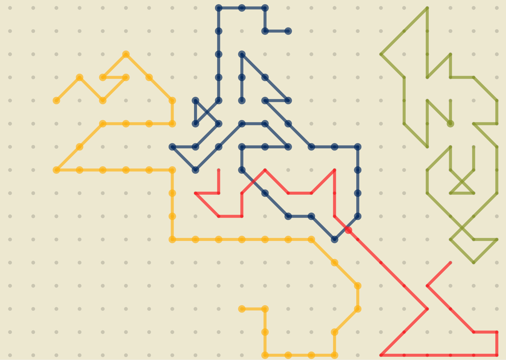

# Subway Lines
Author: Jonathan Zeng
## Description

Subway Lines is a visual generative artwork for a single display exhibition. It is an abstract representation of the beauty of public transit routes and their structure. [Blog](https://app.notion.com/p/Module-1-Project-Subway-Lines-3e4ca9b192a2803a93a8e70a9b5a395f?source=copy_link)

## Video

[Demo Video](https://www.youtube.com/watch?v=MtziSVANRq4)

## How to Run

Simply open `index.html` in your web browser.

Alternatively, to make it run on your raspberry pi on startup automatically, refer to [the autostart .desktop service](../../../raspberrypi/.config/autostart/subwaylines.desktop) and paste that file into a directory called autostart in your .config folder. Change the "Exec=" line to the path of your index.html. After saving the file, Subway Lines should open in fullscreen in a browser on startup on your raspberry pi.

## Configurations

If you would like, you can change some of the global parameters in sketch.js to change the sizing, scaling, or speeds of the program.
