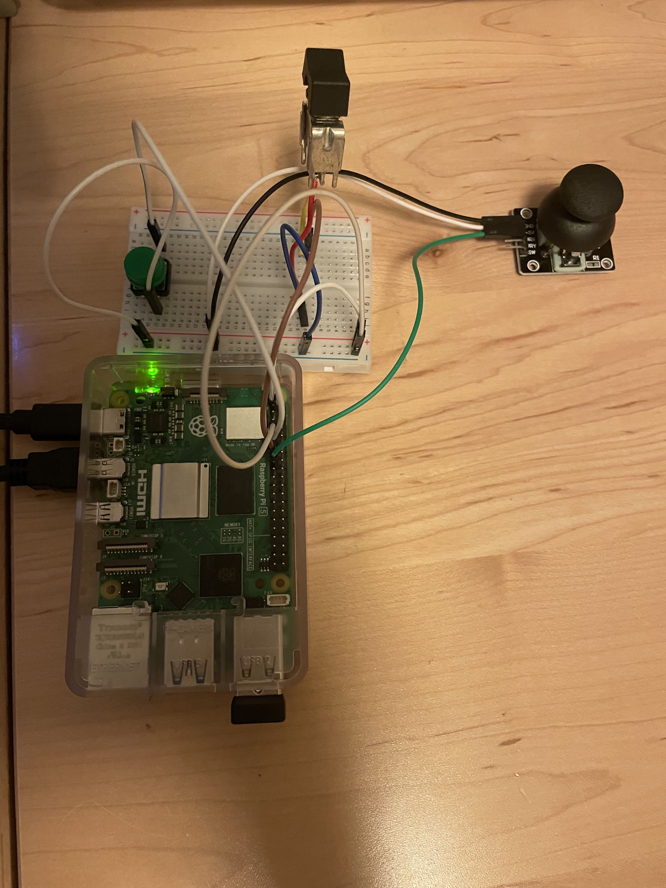
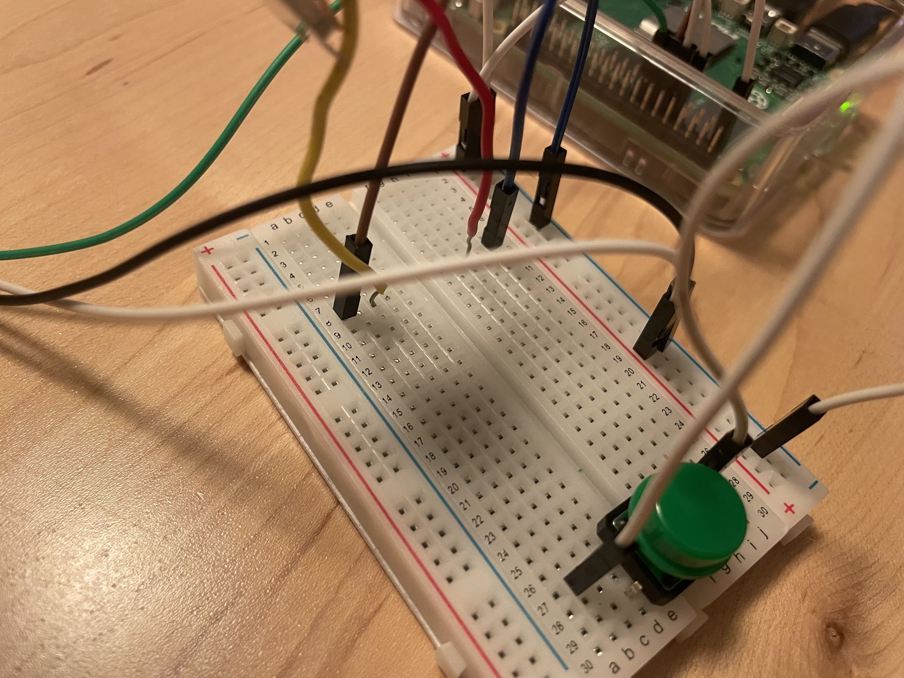

# Lab 3

## Description

In this lab, we create a simple interactive device with a Raspberry Pi 5, a switch, a button, a joystick and a protoboard + wires. To accomplish this goal, we connected the wires so that each of the three input devices had a ground connection and also a connection to a GPIO slot. Additionally, the joystick required power, so we supplied it with a connection from the 3.3v pin on the pi. We also connected the joystick to the pi by simply treating it like a digital button, so we just connected it to one of the gpio pins. We ended up using pins 17, 27, and 22 for the button, switch, and joyx respectively (joyy and switch on the joystick were left unused).

For our python program, we used the gpiozero library, which is a beginner friendly python library pre-installed on the Raspberry Pi OS that allowed us to communicate with our devices. In the program, I modified it from the original lab program to simply detect if each of the three "buttons" were being pressed. Then I would compose an output string that would print to the console which devices were being pressed. This would happen on every iteration of a While True loop, so we can see the output printed in real-time.

There are theoretically a total of 2^3 = 8 modes of operation/states with this current setup, since each of the three buttons can either be on or off, leading to a different output message.

## Video and pictures
[Video](https://youtu.be/Rnwo94HVrYM)

Pictures:

