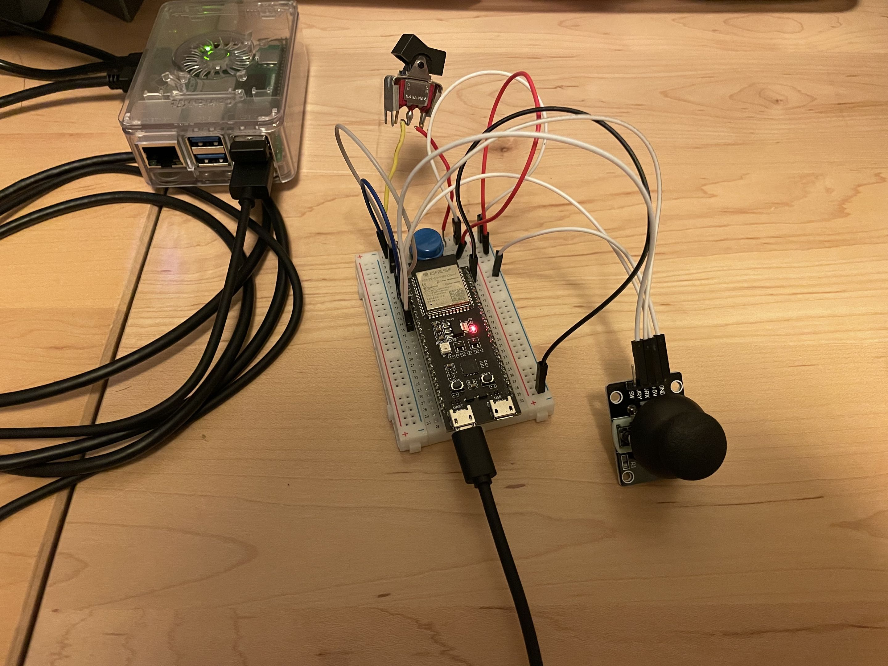
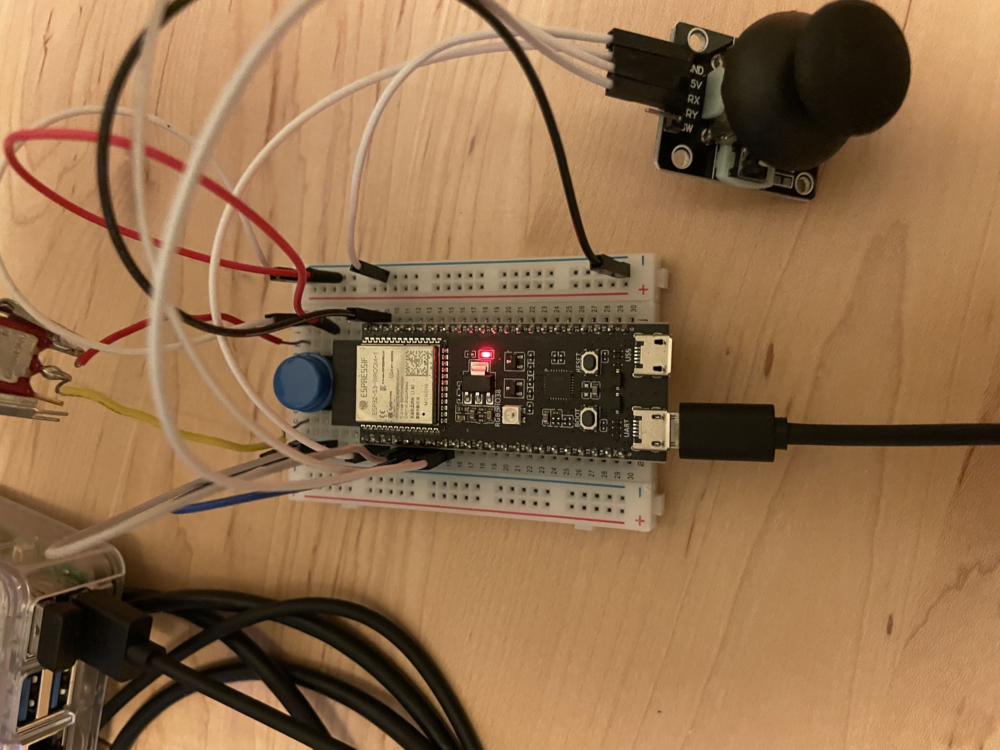

# Lab 4

## Description

In this lab, we use an ESP32 to additionally take in both analog and digital input into our pi. We did this by setting up the Arduino IDE, writing code to detect both the analog and digital input, and then also writing python code on our pi to print the code from our serial bus to the console. 

## Video and pictures
[Video](https://youtu.be/nEdiWhNUvow)

Pictures:

